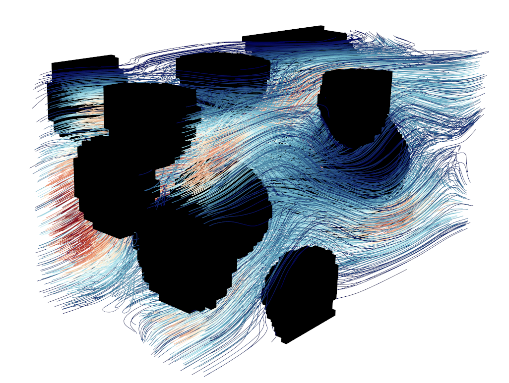
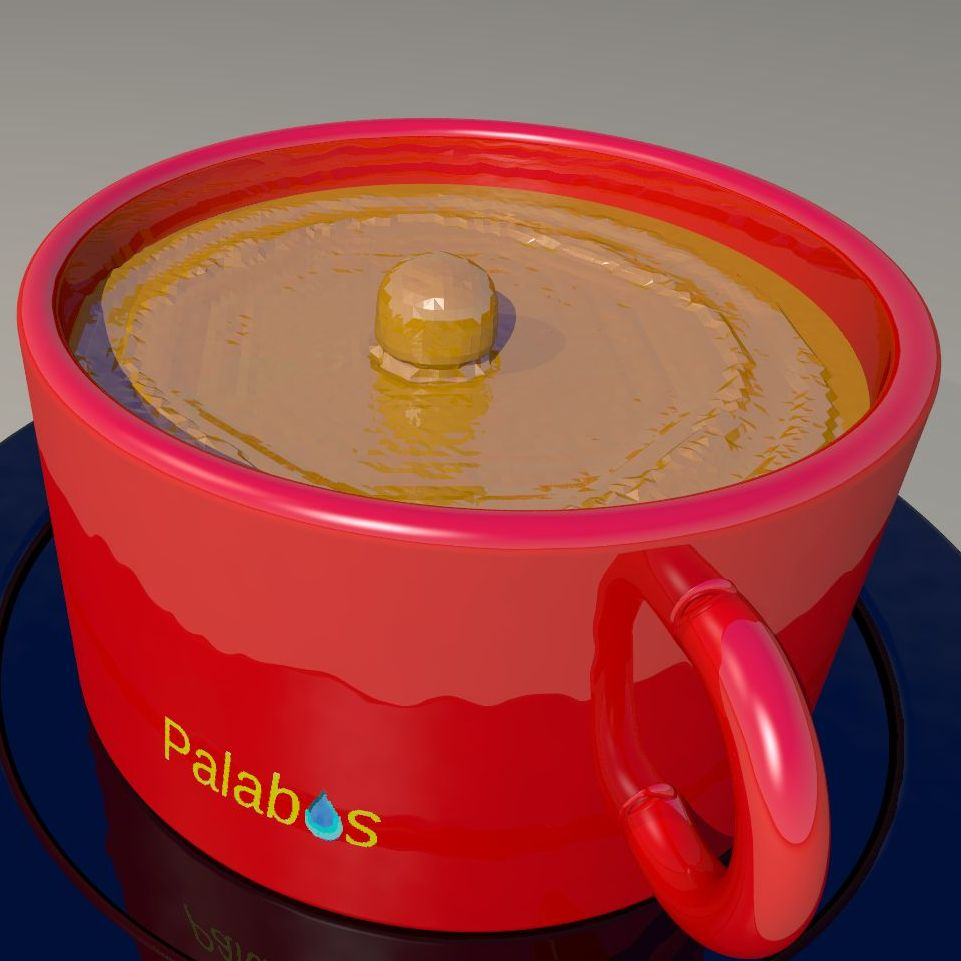

# Symulacje Komputerowe w Fizyce, wydanie 2

Zbiór kodów źródłowych do książki
[Maciej Matyka, "Symulacje Komputerowe w Fizyce", wydanie 2, Helion 2020](https://helion.pl/ksiazki/symulacje-komputerowe-w-fizyce-wydanie-ii-maciej-matyka,sykof2.htm#format/d)

*Lista kodów źródłowych:*

* [**KodyzrodloWe/rOzdzial4/cloth.html**](KodyzrodloWe/rOzdzial4/cloth.html)
  * tkanina złożona z punktów i połączeń sprężystych, możliwość
interakcji z użyciem myszy, metoda Verlet całkowania równań różniczkowych
ruchu, kod i wizualizacja w HTML5

* [**KodyzrodloWe/rOzdzial4/softbody.html**](KodyzrodloWe/rOzdzial4/softbody.html)
  * Ciało miękkie 2D (punkty, sprężyny i siła ciśnienia), kod i wizualizacja w HTML5.

  
* [**KodyzrodloWe/rOzdzial4/konstruktor/konstruktor.html**](KodyzrodloWe/rOzdzial4/konstruktor/konstruktor.html)
  * Replika programu ["Soda Constructor"](https://en.wikipedia.org/wiki/Soda_Constructor) - umożliwia budowanie 
własnych obiektów z dodatkowymi sprężynami, których długość w stanie równowagi jest zależna od czasu (mięśnie)

  
* [**KodyzrodloWe/rOzdzial4/SoftBody3D**](KodyzrodloWe/rOzdzial4/SoftBody3D)
  * Implementacja C++ trójwymiarowego [modelu ciała miękkiego](http://www.ift.uni.wroc.pl/~maq/papers/matyka03.pdf) opartego o ciśnienie. 
  Program wykorzystuje OpenGL i pozwala na symulację w czasie rzeczywistym. 
  Niektóre z obiektów (ręka, koala) wykonał Mariusz Jarosz (dziękuję!).

* [**Kodyzrodlowe/Rozdzial4/lbmfluid_book/**](Kodyzrodlowe/Rozdzial4/lbmfluid_book/)
  * implementacja C/C++ modelu Gazu Sieciowego Boltzmanna LBM w 
  wersji jednofazowej z komentarzami odpowiadającymi układowi w rozdziale z książki. Jest to prosta implementacja modelu
  jednorelaksacyjnego z wizualizacją w OpenGL i biblioteką GLUT. Dodatkowo do kodu dołączone są procedury wizualizacji
  poprzez śledzenie ruchu cząsteczek płynu i ich rozsmarowywanie. Uwaga: możliwe są problemy z podwójnym buforowaniem na niektórych
  systemach operacyjnych, wtedy należy dokładniej przyjrzeć się sterownikom i działaniu OpenGL.

* [**Kodyzrodlowe/Rozdzial4/lbmfluid3D**](Kodyzrodlowe/Rozdzial4/lbmfluid3D)
  * Model [LBM](https://en.wikipedia.org/wiki/Lattice_Boltzmann_methods) w wersji trójwymiarowej, przybliżenie jednorelaksacyjne BGK.
  

* [**Kodyzrodlowe/Rozdzial4/lbmfluid-mrt/**](Kodyzrodlowe/Rozdzial4/lbmfluid-mrt/)
  * Przepływ w komorze (ang. Driven Cavity Flow). Implementacja moelu wielorelaksacyjnego (MRT) przepływu jednofazowego 2D z użyciem LBM dla 
  wysokich [liczb Reynoldsa](https://pl.wikipedia.org/wiki/Liczba_Reynoldsa).

  

* [**Kodyzrodlowe/Rozdzial4/lbmfluid2D-multiphase/**](Kodyzrodlowe/Rozdzial4/lbmfluid2D-multiphase/)
  * Implementacja przepływu wielofazowego 2D z użyciem [LBM](https://en.wikipedia.org/wiki/Lattice_Boltzmann_methods) i modelu Shan-Chen omawianego w
  książce.

* [**Kodyzrodlowe/Rozdzial4/lbmfluid3D-multiphase/**](Kodyzrodlowe/Rozdzial4/lbmfluid3D-multiphase/)
  * Implementacja przepływu wielofazowego 3D z użyciem [LBM](https://en.wikipedia.org/wiki/Lattice_Boltzmann_methods) i modelu Shan-Chen omawianego w
  książce.

* [**Kodyzrodlowe/Rozdzial4/lbmfluid-tauone3D/**](Kodyzrodlowe/Rozdzial4/lbmfluid-tauone3D/)
  * Implementacja modelu LBM bez funckcji rozkładu prędkości w wersji 3D i 2D (model [LBMTAU1](https://arxiv.org/abs/1912.09327)).

  

* [**Kodyzrodlowe/Bonus/81fractalifs/fractalifs.cpp**](Kodyzrodlowe/Bonus/81fractalifs/fractalifs.cpp)
  * Program C/C++ generujący fraktal typu IFS (paproć). Kod wykonany na podstawie książki J. Kudrewicz, Fraktale i chaos, WNT 2015.
  Program generuje plik graficzny typu .ppm (Portable Pixel Map) - prosty format graficzny w trybie ASCII omówiony w książce w rozdziale o symulacji płynów.

* [**Kodyzrodlowe/Bonus/82IsingModel/ising.cpp**](Kodyzrodlowe/Bonus/82IsingModel/ising.cpp)
  * Implementacja modelu sieciowego magnetyzmu (model Isinga), program w C++ z wizualizacją w OpenGL. Program pozwala na obserowanie 
  ewolucji układu spinów w czasie dla różnej temperatury.

  

* [**Kodyzrodlowe/Bonus/ripple2d.html**](Kodyzrodlowe/Bonus/ripple2d.html)
  * Prosty automat komórkowy generujący rozchodzenie się fal w dwóch wymiarach. Kod w HTML5 z wizualizacją w przeglądarce.

    

* [**Kodyzrodlowe/Bonus/ripple2d.html**](Kodyzrodlowe/Bonus/dla.html)
  * Tworzenie struktur - fraktali - DLA ([Diffusion Limited Aggregation](https://en.wikipedia.org/wiki/Diffusion-limited_aggregation)) - bardzo proste, ale ciekawe zjawisko fizyczne i prosty model służący do jego symulacji. Program w JS/HTML5, wizualizacja w czasie rzeczywistym. Interakcja myszą pozwala na dokładanie nowych zarodków fraktala.

  

* [**Kodyzrodlowe/Bonus/PalabosCG/**](Kodyzrodlowe/Bonus/PalabosCG/)
  * Skrypt do biblioteki [Palabos](https://palabos.unige.ch/) umożliwiający rendering 3D z użyciem RayTracingu (PovRay) powierzchni swobodnej płynu.

[(c) Maciej Matyka, 2020](http://panoramix.ift.uni.wroc.pl/~maq/eng/)

